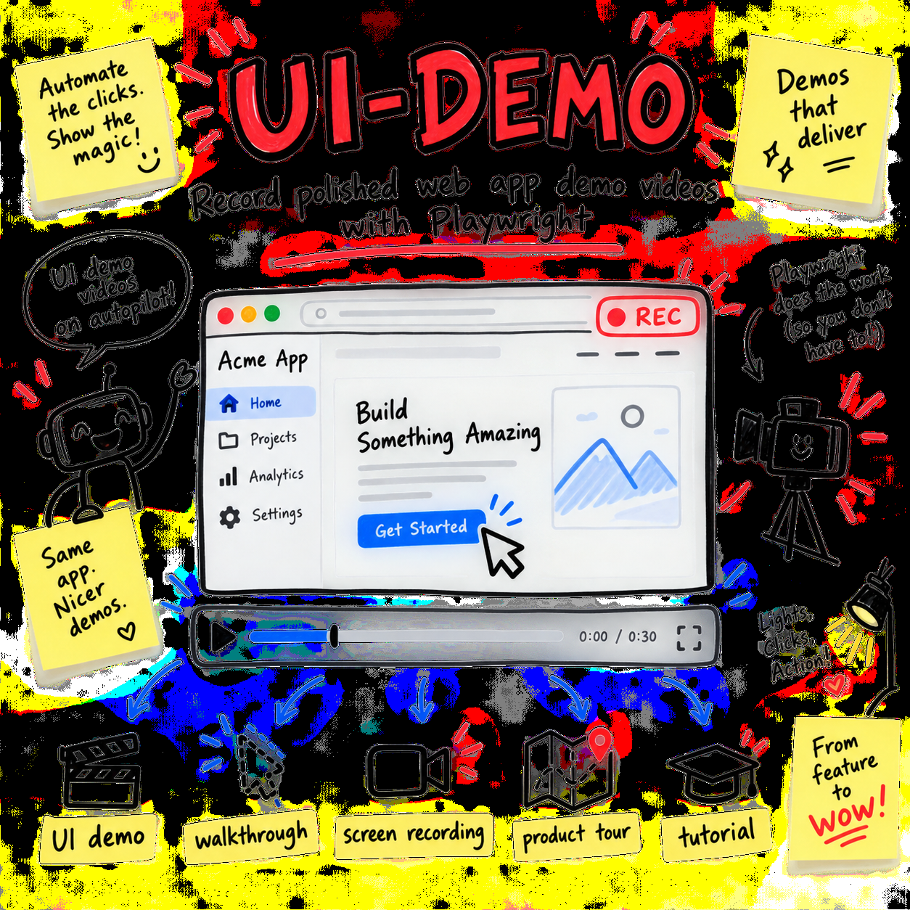

# ui-demo-recorder-plus



    

> **Built on [affaan-m/ECC](https://github.com/affaan-m/ECC)** by @affaan-m (264,766 stars, MIT). All credit for the original idea to them. This fork improves and repackages it; upstream license preserved in [UPSTREAM_LICENSE](UPSTREAM_LICENSE).

**A Claude Code skill that explores, tests, and records clear web app demos with Playwright.**

Made for developers, product teams, and writers who need a clean UI demo, product tour, or how-to video.

## 💡 Why

UI demos often fail because the script does not match the real app.

Buttons move. Forms need hidden fields. Menus use custom controls. Slow pages break fixed waits.

This skill explores the app first, rehearses the full flow, and then records it. It uses a visible cursor, slow typing, and clear timing.

## 📦 Install

Run one command:

```bash
mkdir -p ~/.claude/skills/ui-demo && curl -fsSL https://raw.githubusercontent.com/OWNER/ui-demo-recorder-plus/main/skill/SKILL.md -o ~/.claude/skills/ui-demo/SKILL.md
```

Replace `OWNER` with the GitHub account that hosts this repo.

The skill is one file and has no skill package dependencies. Your demo project still needs Playwright and a browser that Playwright can use.

## 🎬 Usage

Ask Claude Code for a demo in plain words:

```text
Record a UI demo of http://localhost:3000.

Show how to create a test order:
1. Open New Order.
2. Pick the test customer.
3. Set the need-by date.
4. Add one test item.
5. Save the order.
6. Show the saved message.

Use a 1440x900 screen.
Save the video to ./artifacts/create-order.webm.
Do not submit payment, send email, or use private data.
```

Claude will ask for any key facts that are missing. This may include login needs, test data, screen size, output path, and private data that must stay hidden.

It then follows three rules:

1. Explore the real pages and controls.
2. Rehearse the full flow with video off.
3. Record the tested flow as a WebM video.

Expected output:

```text
./artifacts/create-order.webm
```

The recording will show the tested web flow with a visible cursor and clear pacing. The skill will stop before unsafe actions unless you asked for that exact action.

## 🔧 What we changed vs upstream

- 全文が日本語中心から平易な英語へ書き直され、ECCへの帰属表示が本文にも明記された。
- 利用条件が明確化され、静止画・非Webアプリを対象外とする基準が追加された。
- 作業前にURL、操作手順、ログイン、テストデータ、画面サイズ、出力先、秘匿情報を確認する工程が追加された。
- 実フォーム送信・購入・削除・公開などを無断で行わない安全規則と、機密情報を録画しない規則が追加された。
- 探索対象がiframe、shadow DOM、レスポンシブ表示、通知などへ拡張され、セレクターはrole・label・placeholder・test IDを優先する方針になった。

## 📄 License

MIT licensed. The upstream MIT license and credit are preserved in [UPSTREAM_LICENSE](UPSTREAM_LICENSE).